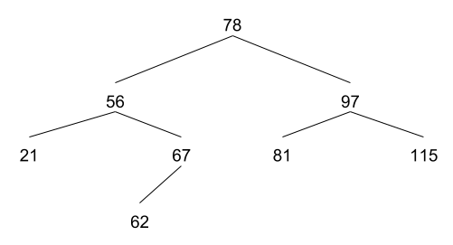
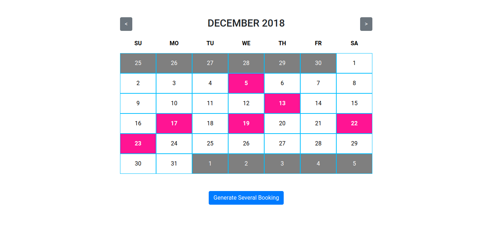

# What is this repo?

This repo contains answers to the following programming questions:

## No. 1
Given an array `[1, 4, 5, 7, 12, 19, 45, 101]`, write a function that returns array that satisfies this condition: `x*2 - (5 - x) == even number`

**Solution:** [number-1.js](number-1.js)

## No. 2 
Write ruby code that model the following left child is always less than the parent & right child is always bigger than the parent. A parent can only have 2 immediate child node. 
   1. Write a method to add item to the model so caller can build the tree like below. 
   2. Then perform a walk of depth first search on the model so we get result like this: 21, 56, 62, 67, 78, 81, 97, 115

**Solution:** [number-2.rb](number-2.rb)

## No. 3 
Write a react form to update user profile. 
   - Fields: first name, last name, email, birth date, preferred job title, number of years experience
   - send data to dummy end point https://api.dummyendpoint/me/profile with http PUT
   - validate fields name and email to be required  

**Solution:** [number-3.html](number-3.html)  
**Demo:** [https://agusputra.github.io/programming-test-1/number-3.html](https://agusputra.github.io/programming-test-1/number-3.html)   

## No. 4 
Write a simple calendar app in react in traditional calendar layout e.g. M, T, W, T, F, S, S table. 
   - There can be one or zero booking for each date.
   - If there is a booking, the cell will have an indicator.
   - Add a button that randomly generate several bookings for that month.
   - The calendar table should update automatically to show these bookings.

**Solution:** [number-4.html](number-4.html)    
**Demo:** [https://agusputra.github.io/programming-test-1/number-4.html](https://agusputra.github.io/programming-test-1/number-4.html)  
**Screenshot:**

## No. 5 
Ruby question; Show how to can retrieve attribute/field of a variable where the variable could be null OR the field could be null.

**Solution:** [number-5.rb](number-5.rb)